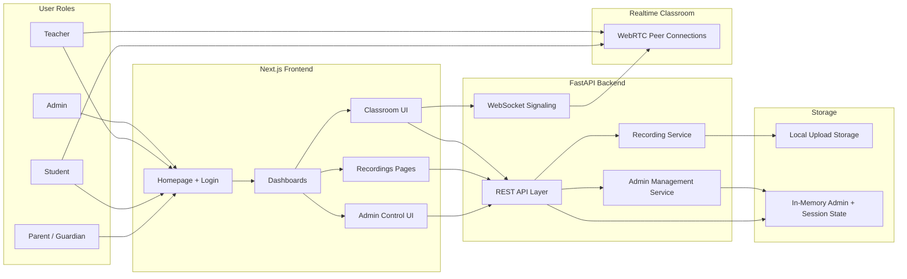
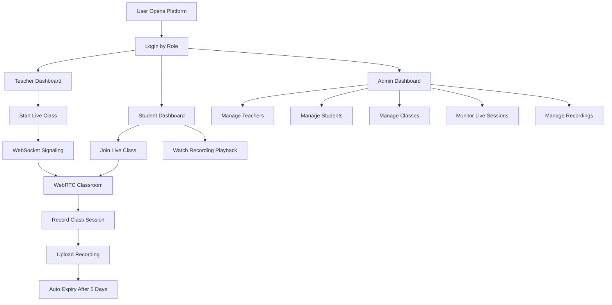

<div align="center">


# We Are Kids Nursery — LMS + Live Class System

**A production-level nursery LMS and live classroom platform for modern schools.**

<br />


</div>

---

## Overview

We Are Kids Nursery is a polished full-stack LMS and live classroom system built to showcase a modern nursery-school product experience. It combines role-based dashboards, live WebRTC classes, recording workflows, expiry automation, and admin management inside a responsive nursery-branded interface.

This repository is designed to feel demo-ready, recruiter-impressive, and startup-grade while still staying technically meaningful and easy to deploy.

## Key Features

- Role-based dashboards for `Admin`, `Teacher`, and `Student`
- Real-time live class sessions using `WebRTC`
- WebSocket signaling workflow for classroom peer connection setup
- Recording upload, playback, rename, delete, and 5-day auto-expiry
- Admin control panel for teachers, students, classes, live sessions, and recordings
- Mobile-responsive nursery-branded UI with polished empty, loading, and error states
- Deployment-ready structure for `Vercel` frontend and `Hugging Face Spaces` backend

## Project Metrics

| Metric | Value |
|---|---|
| User Roles | `3 Core Roles` |
| Live Experience | `Real-Time Classroom Sessions` |
| Video Layer | `WebRTC Peer Calling` |
| Signaling Layer | `WebSocket Classroom Signaling` |
| Recording Lifecycle | `Upload + Playback + 5-Day Expiry` |
| Admin Modules | `Teachers • Students • Classes • Live Sessions • Recordings` |
| Interface Quality | `Nursery-Branded Responsive UI` |
| Deployment Target | `Vercel + Hugging Face Spaces` |

## Architecture

The platform uses a clean two-tier architecture:

- The `Next.js frontend` delivers the homepage, authentication flow, dashboards, classroom views, playback pages, and admin control interfaces.
- The `FastAPI backend` handles REST APIs, admin CRUD endpoints, recording workflows, local upload storage, and classroom signaling.
- The `WebRTC layer` enables direct media exchange between teacher and students after signaling completes.
- The `recording subsystem` stores uploaded class recordings locally and automatically removes expired recordings after five days.
- The `admin layer` centralizes management across teachers, students, classes, live sessions, and recordings.

## Mermaid Architecture Diagram



## User Flow



## Tech Stack

| Layer | Technology |
|---|---|
| Frontend | `Next.js` |
| Language | `TypeScript` |
| Styling | `Tailwind CSS` |
| Backend | `FastAPI` |
| Realtime Video | `WebRTC` |
| Signaling | `WebSockets` |
| Frontend Hosting | `Vercel` |
| Backend Hosting | `Hugging Face Spaces` |

## Local Setup

### Backend

```powershell
cd backend
python -m venv .venv
.venv\Scripts\activate
pip install -r requirements.txt
copy .env.example .env
uvicorn app.main:app --host 0.0.0.0 --port 8000 --reload
```

### Frontend

```powershell
cd frontend
copy .env.example .env.local
npm install
npm run dev
```

## Environment Variables

### Frontend `.env.local`

```env
NEXT_PUBLIC_API_BASE_URL=http://localhost:8000
```

### Backend `.env`

```env
PORT=8000
UPLOAD_DIR=uploads
CORS_ORIGINS=http://localhost:3000,http://127.0.0.1:3000
```

## Deployment

### Frontend on Vercel

1. Push the repository to GitHub.
2. Import the project into Vercel.
3. Set `NEXT_PUBLIC_API_BASE_URL` to your deployed backend URL from Hugging Face Spaces.
4. Deploy the production build.

### Backend on Hugging Face Spaces

1. Create a new Space using the `Docker` SDK.
2. Upload the contents of the `backend/` folder.
3. Keep the included `Dockerfile` in place.
4. Configure the Space variables:
   - `PORT=8000`
   - `UPLOAD_DIR=uploads`
   - `CORS_ORIGINS=https://your-vercel-domain.vercel.app`
5. Deploy the Space.
6. Copy the public Space URL into Vercel as `NEXT_PUBLIC_API_BASE_URL`.

### Production Commands

Backend:

```powershell
uvicorn app.main:app --host 0.0.0.0 --port 8000
```

Frontend:

```powershell
npm run build
```

## Demo Credentials

| Role | Email | Password |
|---|---|---|
| Admin | `admin@wearekids.com` | `123456` |
| Teacher 1 | `teacher1@wearekids.com` | `123456` |
| Teacher 2 | `teacher2@wearekids.com` | `123456` |
| Student 1 | `student1@wearekids.com` | `123456` |
| Student 2 | `student2@wearekids.com` | `123456` |
| Student 3 | `student3@wearekids.com` | `123456` |
| Student 4 | `student4@wearekids.com` | `123456` |

## API Highlights

```http
GET    /health

GET    /api/v1/classes/live
POST   /api/v1/classes/start

POST   /api/v1/recordings/upload
GET    /api/v1/recordings
GET    /api/v1/recordings/{recording_id}
PATCH  /api/v1/recordings/{recording_id}
DELETE /api/v1/recordings/{recording_id}

GET    /api/v1/admin/teachers
GET    /api/v1/admin/students
GET    /api/v1/admin/classes
GET    /api/v1/admin/live-sessions
```

## Build Validation

Backend:

```powershell
python -m compileall backend
```

Frontend:

```powershell
cd frontend
npm run type-check
npm run build
```

## Future Improvements

- Persistent database for users, classes, sessions, and recordings
- Secure authentication with refresh tokens
- Cloud object storage for recordings
- Attendance tracking and live chat
- Parent portal and reporting workflows
- Analytics dashboards and school-level insights
- Native mobile companion apps

---

<div align="center">

Built with care for nursery education, live learning, and modern product presentation.

</div>
