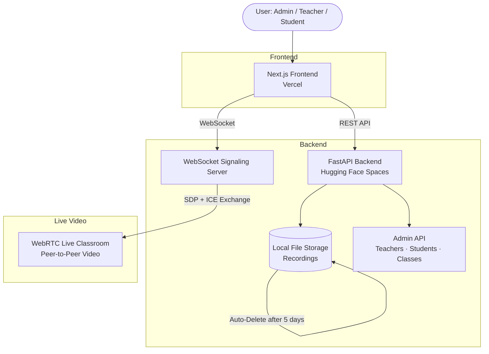

<div align="center">

# We Are Kids Nursery — LMS + Live Class System

### A production-style Learning Management System and live classroom platform built for nurseries and schools

[](https://nextjs.org)
[](https://fastapi.tiangolo.com)
[](https://www.typescriptlang.org)
[](https://tailwindcss.com)
[](https://webrtc.org)

[](https://vercel.com)
[](https://huggingface.co/spaces)
[](.)
[](.)

</div>

---

## About

**We Are Kids** is a full-stack, production-ready Learning Management System designed specifically for nurseries and primary schools. It combines role-based dashboards, a live video classroom powered by WebRTC, an automated recording system, and a comprehensive admin panel — all wrapped in a child-friendly, responsive interface.

Built with **Next.js + FastAPI**, this project is deployable in minutes on Vercel and Hugging Face Spaces.

---

## Project Metrics

| Metric | Value |
|--------|-------|
| User Roles | 3 (Admin, Teacher, Student) |
| Live Classroom | WebRTC peer-to-peer video |
| Signaling | WebSocket-based |
| Recording Retention | 5-day auto-delete |
| Admin Modules | Teachers · Students · Classes · Live Sessions · Recordings |
| API Endpoints | 9+ REST endpoints |
| Responsive Pages | Full mobile & desktop support |
| Deployment Targets | Vercel + Hugging Face Spaces |

---

## Features

### LMS Core
- Role-based dashboards for **Admin**, **Teacher**, and **Student**
- Secure login and session management per role
- Class management with structured listing and status tracking

### Live Classes
- Real-time video classrooms powered by **WebRTC**
- **WebSocket** signaling server for peer connection negotiation
- Teacher-initiated live sessions with student join flow
- Live session status visible across all dashboards

### Recording System
- In-browser classroom recording with upload to backend
- Recordings stored locally in the backend upload directory
- **Auto-delete after 5 days** to manage storage automatically
- Recording history accessible from Admin and Teacher dashboards

### Admin Panel
- Full management of **teachers**, **students**, **classes**, **live sessions**, and **recordings**
- Quick-access views for all active and historical data
- Dashboard metrics for at-a-glance oversight

### UI / UX
- Nursery-branded, child-friendly interface
- Tailwind CSS with a clean, colourful design system
- Production-quality loading states, error boundaries, and fallback messages
- Responsive layout for desktop and mobile devices

---

## Architecture

```
┌─────────────────────────────────────────────────────────┐
│                      Frontend                           │
│               Next.js 15 + TypeScript                   │
│             Tailwind CSS · App Router                   │
└────────────────────┬────────────────────────────────────┘
                     │ REST API  /  WebSocket
┌────────────────────▼────────────────────────────────────┐
│                      Backend                            │
│                FastAPI (Python)                         │
│       Auth · Classes · Recordings · Admin API           │
└────────────┬───────────────────────┬────────────────────┘
             │                       │
  ┌──────────▼──────┐     ┌──────────▼──────────┐
  │  WebSocket      │     │  Local File Storage  │
  │  Signaling      │     │  (Recordings)        │
  └──────────┬──────┘     └─────────────────────┘
             │
  ┌──────────▼──────┐
  │  WebRTC         │
  │  Peer-to-Peer   │
  │  Live Classroom │
  └─────────────────┘

Deployment:
  Frontend → Vercel
  Backend  → Hugging Face Spaces (Docker)
```

---

## Architecture Diagram



---

## Project Flow

```
Admin / Teacher / Student
        │
        ▼
   Login Page
        │
        ▼
 Role-Based Dashboard
        │
   ┌────┴────┐
   │         │
   ▼         ▼
Classes   Live Session
              │
              ▼
        WebRTC Classroom
              │
              ▼
         Recording
              │
              ▼
     Auto-Expiry (5 days)
```

---

## Tech Stack

| Layer | Technology |
|-------|-----------|
| Frontend Framework | Next.js 15 (App Router) |
| Language | TypeScript |
| Styling | Tailwind CSS |
| Backend Framework | FastAPI (Python) |
| Realtime Video | WebRTC |
| Realtime Signaling | WebSockets |
| Frontend Deployment | Vercel |
| Backend Deployment | Hugging Face Spaces (Docker) |

---

## Local Setup

### Backend

```bash
cd backend
python -m venv .venv
.venv\Scripts\activate
pip install -r requirements.txt
copy .env.example .env
uvicorn app.main:app --host 0.0.0.0 --port 8000 --reload
```

### Frontend

```bash
cd frontend
copy .env.example .env.local
npm install
npm run dev
```

---

## Environment Variables

### Frontend `.env.local`

```env
NEXT_PUBLIC_API_BASE_URL=http://localhost:8000
```

### Backend `.env`

```env
PORT=8000
UPLOAD_DIR=uploads
CORS_ORIGINS=http://localhost:3000,http://127.0.0.1:3000
```

---

## Deployment

### Frontend on Vercel

1. Push the repository to GitHub.
2. Import the `frontend/` folder into a new Vercel project.
3. Set the environment variable:
   ```
   NEXT_PUBLIC_API_BASE_URL=https://your-huggingface-space-url
   ```
4. Deploy — Vercel handles the build automatically.

### Backend on Hugging Face Spaces

1. Create a new Hugging Face Space using the **Docker** SDK.
2. Upload the contents of the `backend/` folder to the Space.
3. The included `Dockerfile` allows Hugging Face to build the FastAPI service automatically.
4. Set Space variables:
   ```
   PORT=8000
   UPLOAD_DIR=uploads
   CORS_ORIGINS=https://your-vercel-domain.vercel.app
   ```
5. Deploy the Space and copy its public URL.
6. Add that URL as `NEXT_PUBLIC_API_BASE_URL` in your Vercel project settings.

---

## Demo Login Credentials

> Use these credentials to explore the platform without registration.

| Role | Email | Password |
|------|-------|----------|
| Admin | `admin@wearekids.com` | `123456` |
| Teacher 1 | `teacher1@wearekids.com` | `123456` |
| Teacher 2 | `teacher2@wearekids.com` | `123456` |
| Student 1 | `student1@wearekids.com` | `123456` |
| Student 2 | `student2@wearekids.com` | `123456` |
| Student 3 | `student3@wearekids.com` | `123456` |
| Student 4 | `student4@wearekids.com` | `123456` |

---

## API Highlights

```http
GET    /health
GET    /api/v1/classes/live
POST   /api/v1/classes/start
POST   /api/v1/recordings/upload
GET    /api/v1/recordings
GET    /api/v1/admin/teachers
GET    /api/v1/admin/students
GET    /api/v1/admin/classes
GET    /api/v1/admin/live-sessions
```

---

## Build & Validation

**Backend syntax check:**

```bash
python -m compileall backend
```

**Frontend type-check and build:**

```bash
cd frontend
npm run type-check
npm run build
```

---

## Future Improvements

- JWT-based authentication with refresh tokens
- PostgreSQL or Supabase for persistent data storage
- Cloud storage (S3 / Cloudflare R2) for recordings
- Push notifications for live session alerts
- Parent portal with child progress tracking
- Attendance tracking and reporting
- Multi-language support for international schools

---

## Project Structure

```text
school-lms-live/
├── backend/          # FastAPI application
│   ├── app/
│   ├── Dockerfile
│   └── requirements.txt
├── frontend/         # Next.js application
│   ├── app/
│   ├── components/
│   └── public/
└── README.md
```

---

## Notes

- This project currently uses in-memory data for admin, class, and live-session records.
- Recordings are stored locally in the backend upload directory.
- If the backend is unreachable or the API URL is missing, the frontend displays a friendly fallback message rather than failing silently.

---

<div align="center">

Built with care for nurseries and schools — **We Are Kids**

</div>
